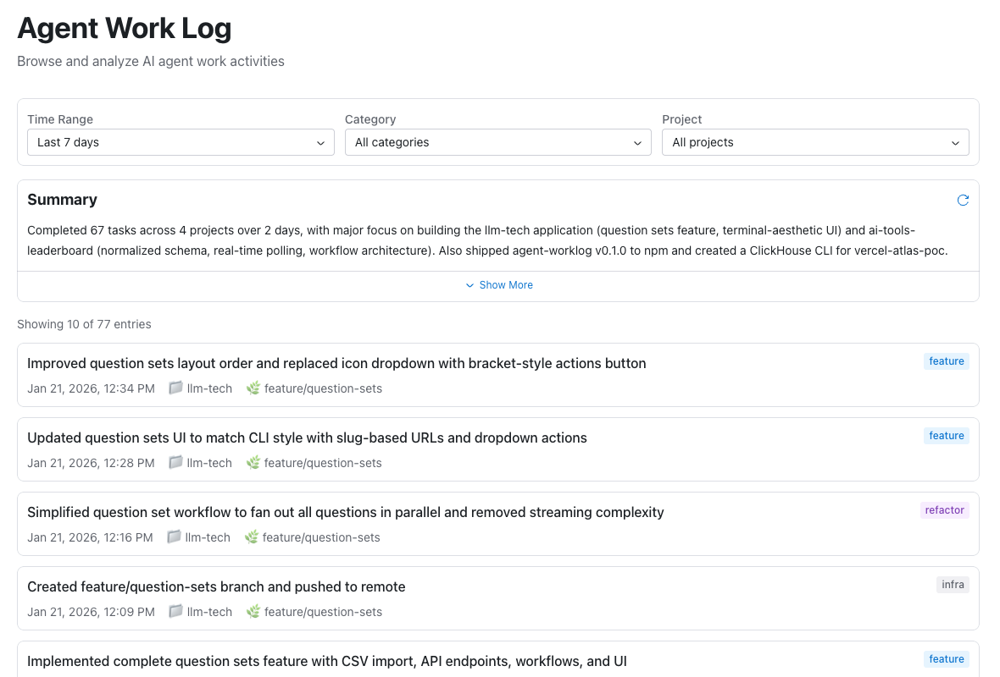

# Agent Worklog

A CLI tool for AI agents to track their work activities, with a web interface for browsing and AI-powered summaries.

## Features

- **AI Summaries**: Generate summaries of completed work with `aw summary`
- **Web Interface**: Browse logs visually with filters and summaries via `aw web`
- **Claude Code Integration**: Skills and instructions for seamless agent integration
- **Automatic Metadata**: Captures project name, git branch, working directory



## Installation

```bash
npm install -g agent-worklog
```

## Setup

Run the install command to set up Claude Code integration:

```bash
aw install --global
```

This configures your `~/.claude/` directory with:
- **Skills**: A `skills/worklog/SKILL.md` file that guides agents on when and how to log work
- **Instructions**: Adds a section to `CLAUDE.md` with concise logging guidelines
- **Permissions**: Grants automatic permission for the `aw` command in `settings.json`
- **Hooks**: Adds a `UserPromptSubmit` hook that reminds agents to log completed work

For project-specific installation (adds to `./.claude/` instead):

```bash
aw install
```

## Commands

### `aw install`

Install Claude Code integration:

```bash
aw install --global     # Install to ~/.claude/ (recommended)
aw install              # Install to ./.claude/ (project-specific)
```

**Options:**
- `-g, --global` — Install globally to `~/.claude/` instead of local `./.claude/`

### `aw uninstall`

Remove Claude Code integration:

```bash
aw uninstall --global   # Remove from ~/.claude/
aw uninstall            # Remove from ./.claude/
```

**Options:**
- `-g, --global` — Uninstall globally from `~/.claude/` instead of local `./.claude/`

### `aw summary`

Generate an AI summary of work entries:

```bash
aw summary                          # Last 7 days
aw summary -d 30                    # Last 30 days
aw summary --project my-app         # Filter by project
aw summary -c feature -d 14         # Features from last 2 weeks
aw summary --json                   # Machine-readable output
```

**Options:**
- `-d, --days <number>` — Days to look back (default: 7)
- `-c, --category <category>` — Filter by category
- `-p, --project <project>` — Filter by project name
- `--json` — Output raw JSON

### `aw web`

Start the web interface to browse your worklog with filters and AI summaries:

```bash
aw web                  # Start server and open web UI
aw web -p 8080          # Custom port
aw web --no-browser     # Don't open browser automatically
```

**Options:**
- `-p, --port <number>` — Port for local API server (default: 24377)
- `--host <url>` — Custom webapp URL for local development
- `--no-browser` — Don't open browser automatically

### `aw task`

Log a completed task. This command is primarily used by AI agents during their work sessions:

```bash
aw task "Implemented JWT authentication" --category feature
aw task "Fixed race condition in db pooling" -c bugfix
aw task "Analyzed auth patterns and recommended OAuth2 approach" -c research
```

**Options:**
- `-c, --category <category>` — Category: feature, bugfix, refactor, docs, config, test, perf, infra, security, research

**Categories:**
| Category | Use for |
|----------|---------|
| `feature` | New functionality or capabilities |
| `bugfix` | Fixed defects or issues |
| `refactor` | Code restructuring without behavior change |
| `docs` | Documentation updates |
| `config` | Build, deployment, or infrastructure setup |
| `test` | Test additions or improvements |
| `perf` | Performance optimizations |
| `infra` | Infrastructure or tooling changes |
| `security` | Security improvements or fixes |
| `research` | Investigation findings, technical analysis, exploration conclusions |
